# BKDrafts — Monorepo

AI-powered bankruptcy drafting assistant. This monorepo contains the **backend** (Python/FastAPI) and **frontend** (React/Vite/TypeScript) for the full application.

---

## Project Structure

```
bkdrafts-monorepo/
├── backend/     # FastAPI + LangGraph AI agents, Gmail integration, PDF generation
└── frontend/    # React + Vite + TypeScript UI
```

---

## Backend (`/backend`)

> Python · FastAPI · LangGraph · LangChain · PostgreSQL · Redis · TaskIQ

### Tech Stack
- **FastAPI** — REST API + SSE streaming endpoints
- **LangGraph / LangChain** — AI agent orchestration (ReAct agents)
- **Claude / OpenAI** — LLM inference via `init_chat_model`
- **ChromaDB** — Per-session vectorstore for Gmail + PDF context
- **TaskIQ** — Background task queue (broker: Redis)
- **PostgreSQL** — Primary database
- **Docker** — Containerized via `docker-compose.yml`

### Setup

```bash
cd backend

# Create and activate virtual environment
python -m venv venv
source venv/bin/activate  # Windows: venv\Scripts\activate

# Install dependencies
pip install -r requirements.txt

# Copy and fill in environment variables
cp .env.example .env

# Run the development server
uvicorn src.main:app --reload
```

### TODO / What needs to be done
- [ ] Set up `.env` with all required keys (OpenAI/Claude API key, DB URL, Redis URL, Gmail OAuth credentials)
- [ ] Run database migrations
- [ ] Configure Gmail OAuth2 (`credentials.json` + `token.json`) for Gmail extraction
- [ ] Verify TaskIQ worker starts correctly: `taskiq worker src.taskiq_app:broker`
- [ ] Review and remove legacy/unused L4 functions in `src/gmail/service.py`
- [ ] Clean up backup files: `src/gmail/_agent_backup.py`, `_tools_backup.py`, `_prompts_backup.py`
- [ ] Complete subject-filtered Gmail extraction feature (see `src/gmail/` details)
- [ ] Add test coverage for AI agent payloads

---

## Frontend (`/frontend`)

> React · Vite · TypeScript · Tailwind CSS · Vitest · Playwright

### Tech Stack
- **React + Vite** — SPA with fast HMR dev server
- **TypeScript** — Strictly typed components
- **Tailwind CSS** — Utility-first styling
- **Vitest** — Unit + component tests
- **Playwright** — End-to-end tests
- **Nginx** — Production static file serving (via Docker)

### Setup

```bash
cd frontend

# Install dependencies
npm install

# Copy and fill in environment variables
cp .env.example .env

# Run the development server
npm run dev
```

### Available Scripts

| Command | Description |
|---|---|
| `npm run dev` | Start dev server |
| `npm run build` | Production build |
| `npm run test` | Run unit tests (Vitest) |
| `npm run test:e2e` | Run end-to-end tests (Playwright) |
| `npm run lint` | Lint with ESLint |

### TODO / What needs to be done
- [ ] Set up `.env` with backend API base URL
- [ ] Verify SSE streaming works against the local backend
- [ ] Complete agent revamp UI (`feat/agt-revamp` branch work)
- [ ] Add missing unit test coverage for chat/streaming components
- [ ] Review Playwright e2e suite for any broken tests after agent revamp
- [ ] Clean up unused doc/spec `.md` files in root if no longer needed

---

## Running the Full Stack (Docker)

```bash
# From the repo root — runs both services together
docker-compose -f backend/docker-compose.yml up --build
```

---

## Screenshots

### Case Workspace — AI Petition Reviewer
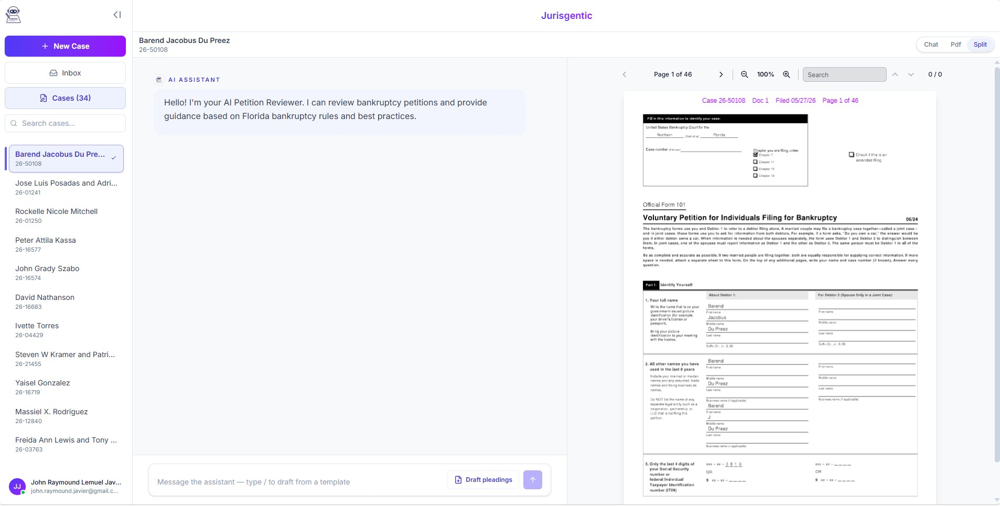
The main drafting workspace. The left panel lists all active cases, the center panel shows the AI assistant chat for reviewing bankruptcy petitions, and the right panel renders the uploaded petition PDF (Official Form 101) side-by-side for reference.

---

### Settings — Firm Profile
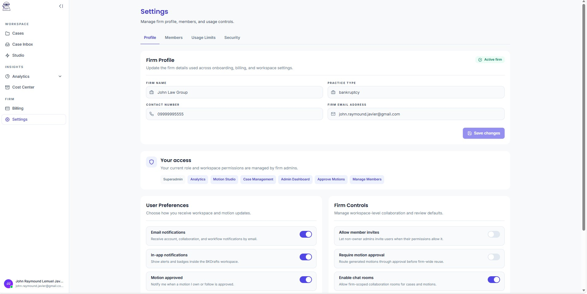
The firm profile settings page where admins can update the firm name, practice type, contact number, and email. Also includes user notification preferences and firm-level controls such as member invite policies, motion approval routing, and collaboration room access.

---

### Settings — Members Management
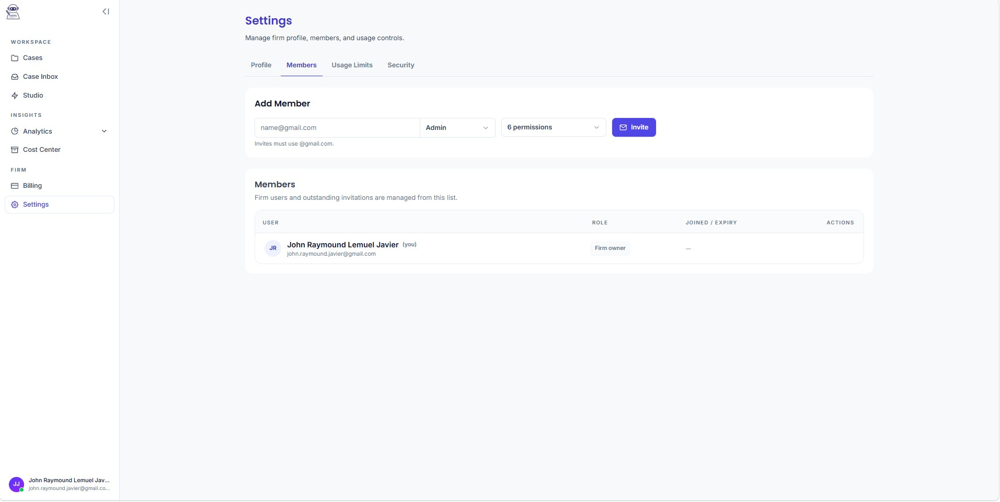
The Members tab under Settings. Admins can invite new users by email, assign roles (e.g. Admin), and configure permissions. The members table displays all current firm users along with their roles and join dates.

---

### Settings — Usage Limits
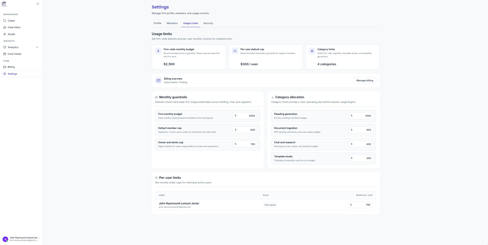
Firm-wide usage limit controls. Admins can set a monthly firm budget, default per-user cap, and category-level spending limits across Pleading Generation, Document Ingestion, Chat & Research, and Template Studio.

---

### Settings — Security
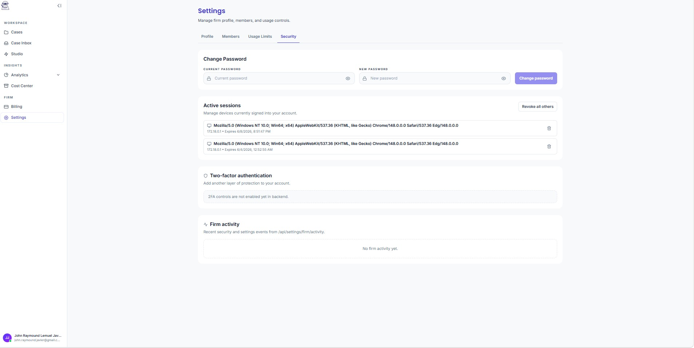
The Security tab shows active login sessions with device/browser details, provides a password change form, and displays a firm activity log. Two-factor authentication (2FA) is visible but pending backend enablement.

---

### Analytics Overview — Dashboard
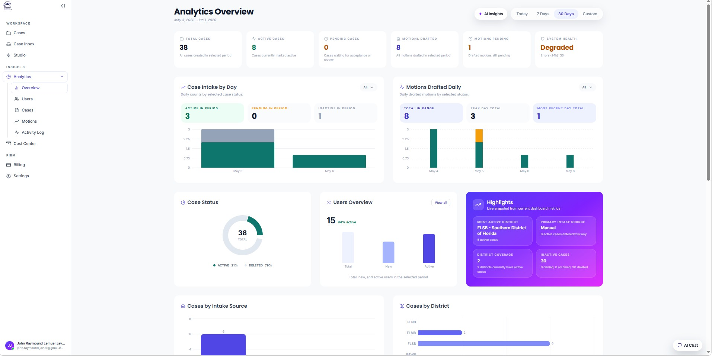
The main analytics dashboard showing firm-wide metrics: total cases, active cases, motions drafted and pending, and system health status. Includes bar charts for case intake by day and motions drafted daily, a case status donut chart, user overview, and an AI Highlights card with key insights.

---

### Analytics — AI Insights Panel
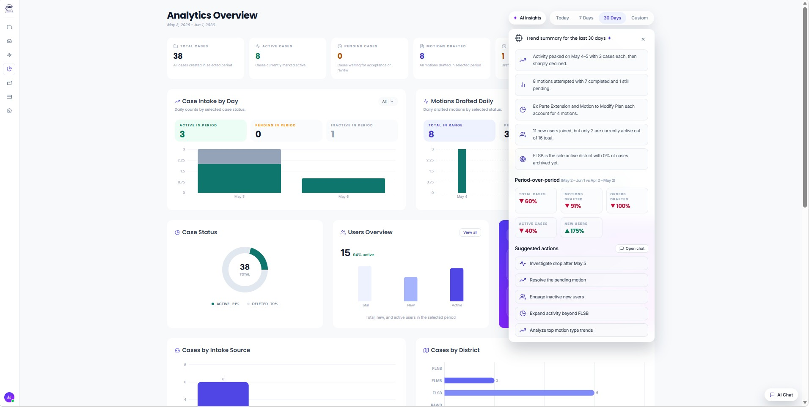
The AI Insights side panel overlaying the analytics dashboard. Displays a 30-day trend summary with period-over-period comparisons (e.g. motions drafted down 91%) and a list of AI-suggested actions such as investigating activity drops, resolving pending motions, and expanding district coverage.

---

### Analytics — AI Chat Integration
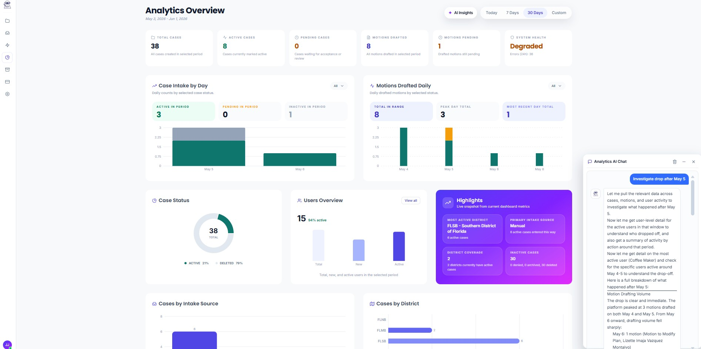
The Analytics AI Chat panel in action. The AI assistant analyzes live dashboard data conversationally — here it investigates the activity drop after May 5 by pulling case, motion, and user-level detail, and provides a full breakdown of drafting volume changes per day.

---

### Cost Center
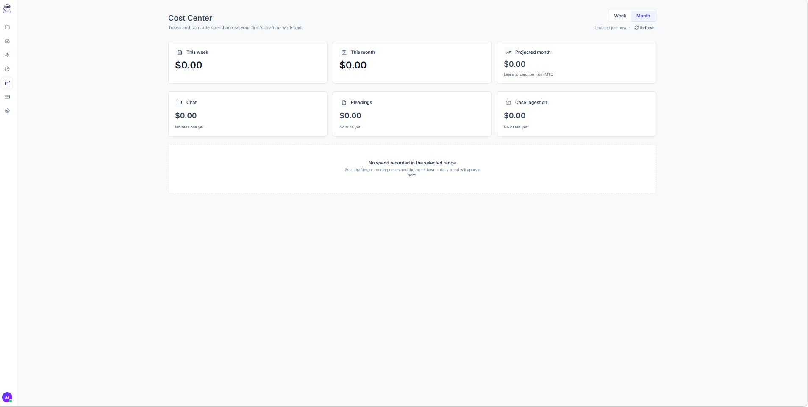
The Cost Center tracks token and compute spend across the firm's drafting workload. Spend is broken down by category: Chat, Pleadings, and Case Ingestion, with weekly, monthly, and projected monthly totals displayed.

---

### Billing — Subscription Plans
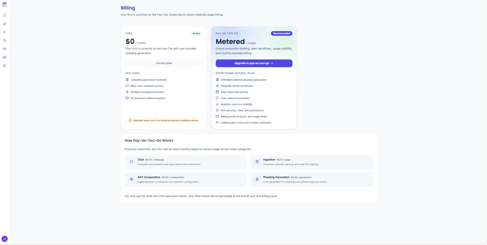
The Billing page showing the Free Tier vs. Pay-as-You-Go (Metered) plan. The metered plan unlocks unlimited pleading generation, template studio, analytics, and collaboration features. Pricing is broken down per usage category: Chat ($0.03/message), Ingestion ($0.12/page), AGT Composition ($6.50), and Pleading Generation ($8.85).

---

### Analytics — System Health & API Metrics
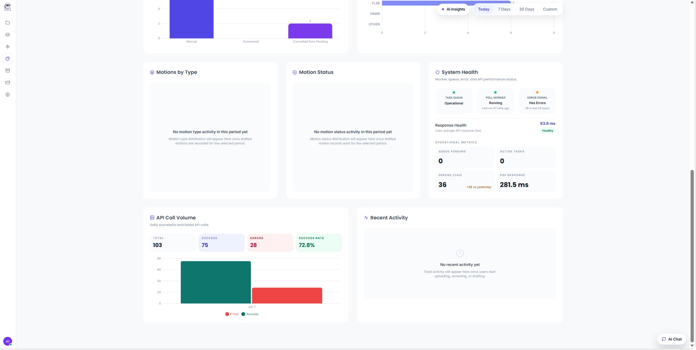
The lower section of the analytics dashboard. Shows Motions by Type and Motion Status distributions, a System Health panel (task queue, poll worker status, error signal, API response time), and an API Call Volume bar chart with success/error breakdown and daily success rate.

---

## Notes
- Both services were previously maintained in separate private repositories.
- Sensitive files (`.env`, `credentials.json`, `token.json`) are excluded via `.gitignore` — never commit these.
