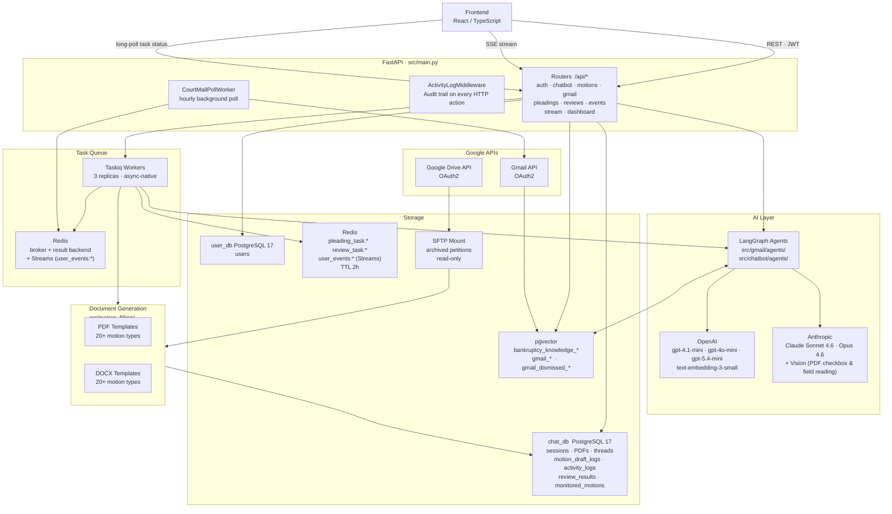
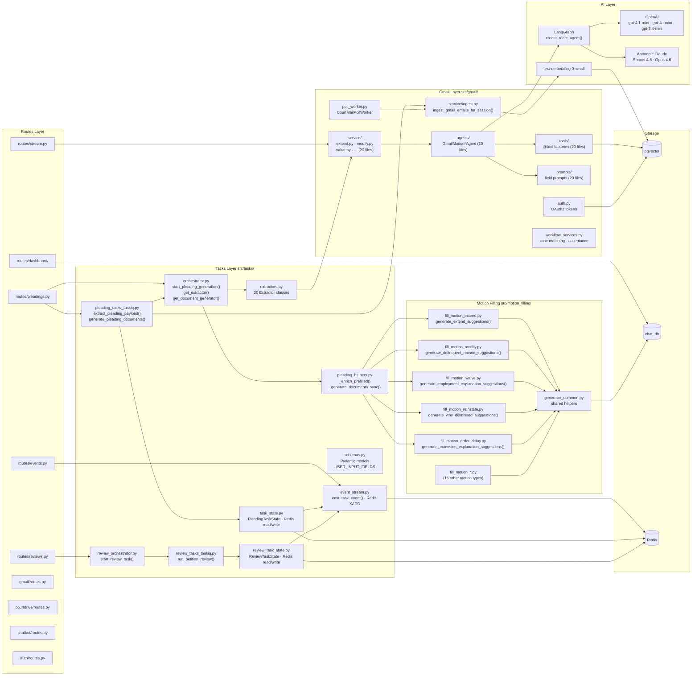
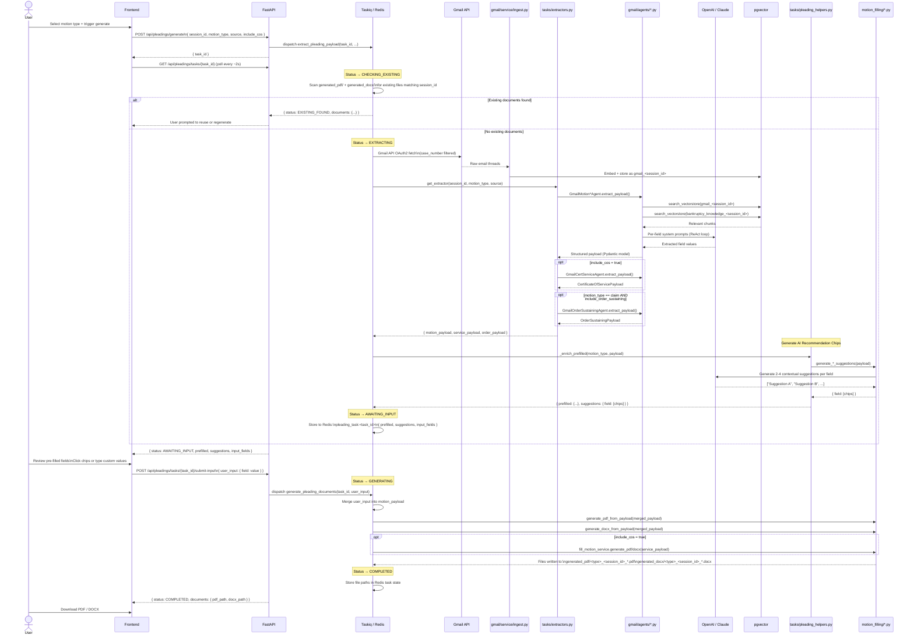
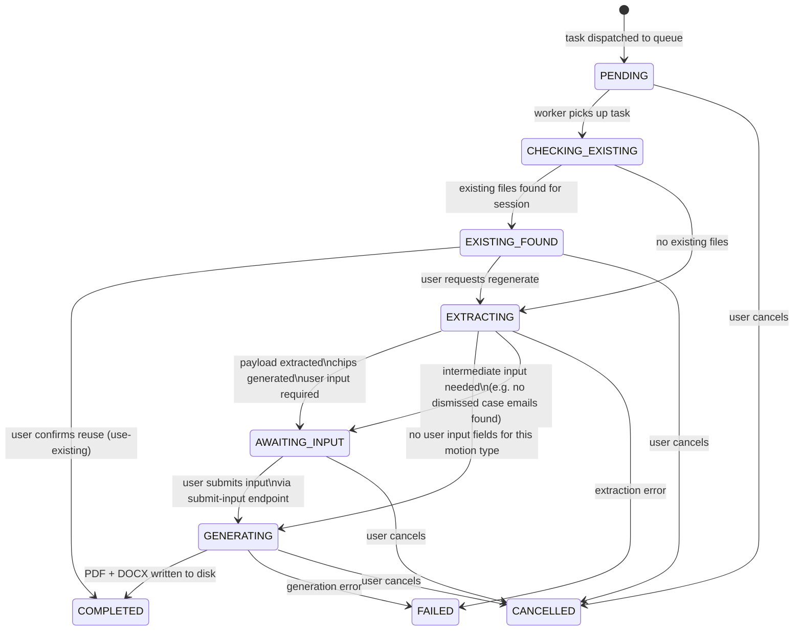
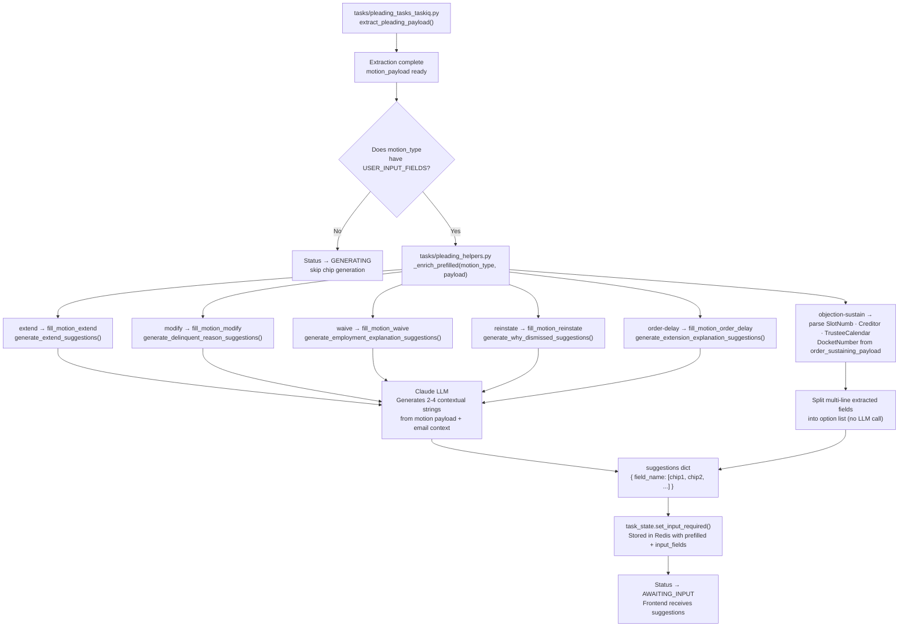
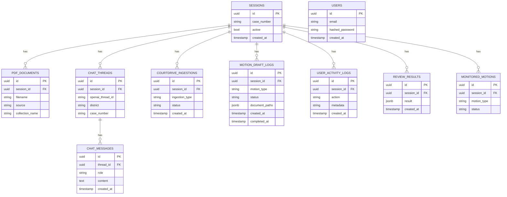
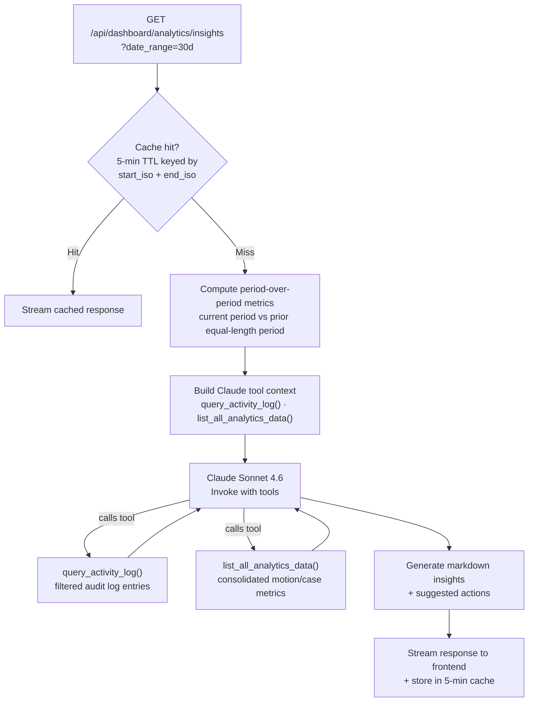
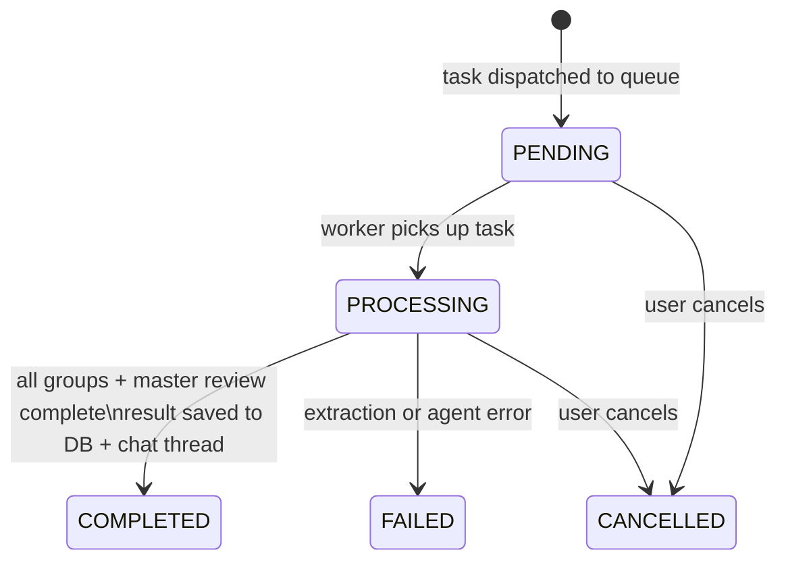
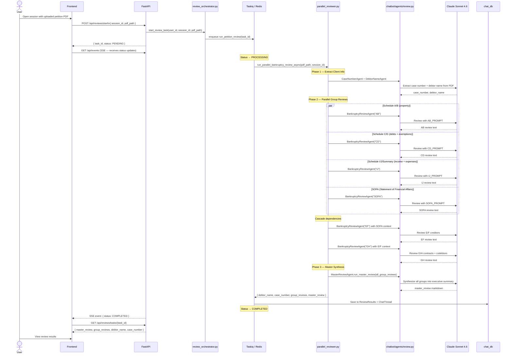
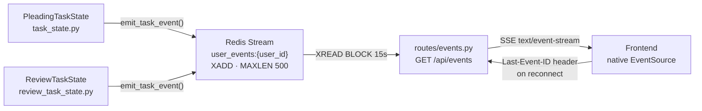

# BKDrafts Backend — Architecture

BKDrafts is an AI-powered backend for bankruptcy attorneys. It automates motion drafting by ingesting court emails via Gmail, extracting structured fields using LLM agents, filling legal document templates (PDF/DOCX), and running petition reviews — all orchestrated through an async task queue.

---

## Table of Contents

1. [System Architecture](#1-system-architecture)
2. [Module Interconnections](#2-module-interconnections)
3. [Pleading Generation Flow](#3-pleading-generation-flow)
4. [Task State Machine](#4-task-state-machine)
5. [Recommendation Chips](#5-recommendation-chips)
6. [Motion Type Reference](#6-motion-type-reference--extraction--document-mapping)
7. [Database Layout](#7-database-layout)
8. [Vectorstore Collections](#8-vectorstore-collections)
9. [AI Models & Usage](#9-ai-models--usage)
10. [Background Services](#10-background-services)
11. [Frontend Connection Patterns](#11-frontend-connection-patterns)
12. [Dashboard Analytics](#12-dashboard-analytics)
13. [Petition Review Flow](#13-petition-review-flow)
14. [Task Event Stream](#14-task-event-stream)
15. [Key Environment Variables](#15-key-environment-variables)

---

## 1. System Architecture



---

## 2. Module Interconnections



---

## 3. Pleading Generation Flow



---

## 4. Task State Machine



**Redis key pattern:** `pleading_task:<task_id>` · `review_task:<task_id>` · TTL: 2 hours

**Task payload stored in Redis:**
```json
{
  "task_id": "uuid",
  "status": "AWAITING_INPUT",
  "motion_type": "extend",
  "session_id": "session-uuid",
  "motion_payload": { "...extracted fields..." },
  "service_payload": { "...cos fields..." },
  "input_fields": ["dismissal_reason", "change_in_circum"],
  "prefilled": { "debtor_name": "John Doe", "dismissal_reason": "", "..." },
  "suggestions": {
    "dismissal_reason": ["Previous case dismissed due to insufficient income", "..."],
    "change_in_circum": ["Debtor returned to full-time employment", "..."]
  }
}
```

---

## 5. Recommendation Chips

Chips are AI-generated suggestion strings shown to the attorney for free-text fields. The attorney can click a chip to auto-fill a field or type their own value.



**Chips per motion type:**

| Motion Type | Field | Chip Source |
|---|---|---|
| `extend` | `dismissal_reason` | Claude — generates from dismissed case email context |
| `extend` | `change_in_circum` | Claude — generates from petition + employment context |
| `modify` | `delinquent_reason` | Claude — generates from payment history context |
| `waive` | `employment_explanation` | Claude — generates from employment/income context |
| `reinstate` | `WhyDismissedDetailed` | Claude — generates from dismissal email context |
| `order-delay` | `WhyExtensionNeeded` | Claude — generates from delay motion context |
| `objection-sustain` | `SlotNumb`, `Creditor`, `TrusteeCalendar`, `DocketNumber` | Parsed directly from extracted claim email fields (no LLM) |

---

## 6. Motion Type Reference — Extraction & Document Mapping

Every motion type has a dedicated agent for extraction and a dedicated filler for document generation.

| Motion Type | Gmail Agent | Extraction Source | Motion Filling File | Output Documents | User Input Fields |
|---|---|---|---|---|---|
| `extend` | `agents/extend.py` | Gmail dismissed case emails + petition PDF | `fill_motion_extend.py` | Motion to Extend the Stay (PDF + DOCX) | `dismissal_reason`, `change_in_circum` |
| `modify` | `agents/modify.py` | Gmail payment/creditor emails + petition PDF | `fill_motion_modify.py` | Motion to Modify (PDF + DOCX) | `delinquent_reason`, `creditors`, `claim_slot` |
| `value` | `agents/value.py` | Gmail valuation emails + petition PDF | `fill_motion_value.py` | Motion to Value (PDF + DOCX) | `Select1`, `Select2`, `Percent1`, `Price1`, `...` |
| `withdraw` | `agents/withdraw.py` | Gmail attorney/debtor emails + petition PDF | `fill_motion_withdraw.py` | Motion to Withdraw (PDF + DOCX) | _(none — fully auto)_ |
| `waive` | `agents/waive.py` | Gmail employment/fee emails + petition PDF | `fill_motion_waive.py` | Motion to Waive Filing Fee (PDF + DOCX) | `employment_explanation` |
| `claim` | `agents/objection_claim.py` | Gmail creditor/claim emails + petition PDF | `fill_motion_claim.py` | Objection to Claim (PDF + DOCX) | `Basis` |
| `delay` | `agents/delay.py` | Gmail property/creditor emails + petition PDF | `fill_motion_delay.py` | Motion to Delay (PDF + DOCX) | `ReasonForDelay`, `Explain`, `IfReaffirmation` |
| `reinstate` | `agents/reinstate.py` | Gmail dismissal history emails + petition PDF | `fill_motion_reinstate.py` | Motion to Reinstate (PDF + DOCX) | `WhyDismissedDetailed` |
| `suggestion` | `agents/suggestion.py` | Gmail legal action emails + petition PDF | `fill_motion_suggestion.py` | Suggestion of Bankruptcy (PDF + DOCX) | `CaseNumber`, `Creditor`, `County`, `CircuitNumber` |
| `loe` | `agents/cert_service.py` | Gmail trustee emails + petition PDF | `fill_motion_loe.py` | Letter of Explanation (PDF + DOCX) | `explanation` |
| `ex-parte-extension` | `agents/ex_parte_extension.py` | Gmail deadline emails + petition PDF | `fill_ex_parte_motion_extension.py` | Ex Parte Extension (PDF + DOCX) | _(none — fully auto)_ |
| `order-extend` | `agents/order_extend.py` | Gmail extend motion + hearing emails | `fill_order_granting_extend.py` | Order on Extend — regular or expedite variant (PDF + DOCX) | `CalendarDate`, `DocketMotion`, `OptionalConditions` |
| `order-value` | `agents/order_value.py` | Gmail value motion + hearing emails | `fill_order_value.py` | Order on Value (PDF + DOCX) | `Creditor`, `DocketNumber`, `TrusteeCalendar`, `CarModel`, `Value`, `...` |
| `order-delay` | `agents/order_delay.py` | Gmail delay motion + hearing emails | `fill_motion_order_delay.py` | Order on Delay (PDF + DOCX) | `WhyExtensionNeeded` |
| `order-withdraw` | `agents/order_withdraw.py` | Gmail withdraw hearing emails | `fill_order_withdraw.py` | Order on Withdraw (PDF + DOCX) | `TrusteeCalendar`, `DocketNumber` |
| `order-waive` | `agents/order_waive.py` | Gmail waive hearing emails | `fill_order_waive.py` | Order on Waive (PDF + DOCX) | `TrusteeCalendar`, `DocketNumber` |
| `order-reinstate` | `agents/order_reinstate.py` | Gmail reinstate hearing emails | `fill_order_reinstate.py` | Order on Reinstate (PDF + DOCX) | `X1`, `X2`, `X3` |
| `notice-withdraw` | `agents/notice_withdraw.py` | Gmail notice emails + petition PDF | `fill_notice_withdraw.py` | Notice of Withdrawal (PDF + DOCX) | `ECFNumber`, `DocumentTitle` |
| `objection-sustain` | `agents/order_sustaining_objection.py` | Derived from `claim` extraction | `fill_order_sustaining_objection.py` | Order Sustaining Objection (PDF + DOCX) | `SlotNumb`, `Creditor`, `TrusteeCalendar`, `DocketNumber` |
| `order-extension` | `agents/order_extension.py` | Gmail extension emails + petition PDF | `fill_order_extension.py` | Order on Motion for Extension (PDF + DOCX) | _(none — fully auto)_ |

**Every motion type also optionally generates:**
- `fill_motion_service.py` → Certificate of Service (PDF + DOCX) when `include_cos=true`

---

## 7. Database Layout



**Three separate PostgreSQL instances:**

| Instance | Env prefix | Purpose |
|---|---|---|
| `chat_db` | `CHAT_DATABASE_*` | Sessions, PDFs, threads, messages, motion logs, activity logs, reviews, monitored motions |
| `user_db` | `USER_DATABASE_*` | User credentials only |
| `vectorstore` | `VECTORSTORE_*` | pgvector — all embedded document chunks |

---

## 8. Vectorstore Collections

| Collection Name | Content | Created By | Consumed By |
|---|---|---|---|
| `bankruptcy_knowledge_<session_id>` | Petition PDF pages (chunked + embedded) | `chatbot/vectorestore.py` on PDF upload | All extraction agents — petition context |
| `gmail_<session_id>` | Court email threads (embedded) | `gmail/service/ingest.py` on Gmail ingest | All Gmail extraction agents |
| `gmail_dismissed_<session_id>` | Dismissed case emails only | `gmail/service/ingest.py` | Motion `extend` agent only |
| `generated_motion` | Text extracted from generated DOCX | `tasks/pleading_helpers.py` after doc generation | Future agent references to previously drafted motions |

---

## 9. AI Models & Usage

| Model | Provider | Temperature | Used For |
|---|---|---|---|
| `gpt-4.1-mini` | OpenAI | 0.3 | LangGraph ReAct agents — Gmail field extraction (all 20 motion types), chatbot reasoning |
| `gpt-4o-mini` | OpenAI | 0.7 | Creative text enhancement inside motion templates (`motion_filling/*.py`) |
| `gpt-5.4-mini` (reasoning=`low`) | OpenAI | 0 | Complex trustee reasoning — `extend` motion agent only |
| `text-embedding-3-small` | OpenAI | — | Embedding petition PDFs + court emails into pgvector |
| `claude-sonnet-4-6` | Anthropic | 0 | Chatbot agents (`agents/chat.py`), parallel petition review (`agents/review.py`), Gmail field extraction, recommendation chips, dashboard AI insights (`analytics_insights.py`), Claude Vision PDF queries (`petition_vision_extractor.py`) |
| `claude-opus-4-6` | Anthropic | 0 | Deep reasoning on complex extraction tasks |

---

## 10. Background Services

| Service | File | Trigger | What It Does |
|---|---|---|---|
| `CourtMailPollWorker` | `src/gmail/poll_worker.py` | Hourly (`COURT_MAIL_POLL_INTERVAL_SECONDS=3600`) + optional on startup | Fetches up to 50 new court emails via Gmail API, embeds + stores per active session |
| `cleanup_stale_tasks` | `src/tasks/cleanup_tasks_taskiq.py` | Every 5 min (Taskiq scheduler) | Removes tasks stuck in non-terminal states beyond threshold time |
| `reconcile_auto_archived_petitions` | `src/tasks/cleanup_tasks_taskiq.py` | Every 30 min (Taskiq scheduler) | Marks pending sessions whose petition files were archived as inactive |
| `ActivityLogMiddleware` | `src/main.py` | Every HTTP request | Intercepts all API responses (status < 400), logs action name + metadata + duration to `user_activity_logs` table |

---

## 11. Frontend Connection Patterns

| Pattern | Endpoint Pattern | Used For |
|---|---|---|
| **REST + JWT** | `/api/auth/*`, `/api/chatbot/*`, `/api/motions/*` | Login, session management, PDF upload, file download, dashboard |
| **Long-poll** | `GET /api/pleadings/tasks/{task_id}` | Client polls every ~2s waiting for `AWAITING_INPUT` or `COMPLETED` |
| **Long-poll** | `GET /api/reviews/tasks/{task_id}` | Same pattern for petition review tasks |
| **SSE** | `GET /api/events?user_id={uid}` | Real-time task state push for both pleading + review tasks via Redis Streams; supports `Last-Event-ID` reconnect |
| **SSE** | `GET /api/motion-objection-sustain-stream/{session_id}` | Real-time generation progress for objection sustain motion |
| **SSE** | `GET /api/pdf/{session_id}/analyze-stream` | Real-time PDF analysis progress on petition upload |
| **SSE** | `GET /api/dashboard/analytics/insights` | Streaming Claude-generated dashboard insights |

No WebSockets — all real-time communication is SSE or client-side polling.

---

## 12. Dashboard Analytics

The dashboard (`src/routes/dashboard/`) is assembled from 9 sub-modules and exposes analytics, KPIs, AI-powered insights, an audit log, and data exports.

### Endpoint Reference

| Endpoint | Module | Description |
|---|---|---|
| `GET /api/dashboard/cases` | `kpis.py` | Global case KPI: total, active, by chapter |
| `GET /api/dashboard/users` | `kpis.py` | User KPI: total registered, active |
| `GET /api/dashboard/motions` | `kpis.py` | Motion KPI: total by type, orders vs motions |
| `GET /api/dashboard/charts/motions-daily` | `kpis.py` | 30-day motion volume trend |
| `GET /api/dashboard/charts/cases-daily` | `kpis.py` | 30-day case volume trend |
| `GET /api/dashboard/charts/motions-by-type` | `kpis.py` | Motion composition data (pie chart) |
| `GET /api/dashboard/system/status` | `kpis.py` | Court-mail poll worker health, last run time + result |
| `GET /api/dashboard/analytics/insights` | `analytics_insights.py` | Claude-powered AI insights (SSE, streaming) |
| `GET /api/dashboard/analytics/users` | `analytics_users.py` | Per-user activity breakdown |
| `GET /api/dashboard/analytics/users/{user_id}` | `analytics_users_detail.py` | Single-user detail with activity trend |
| `GET /api/dashboard/analytics/cases` | `analytics_cases.py` | Case list with status, chapter, motion history |
| `GET /api/dashboard/analytics/motions` | `analytics_motions.py` | Motion history by type, session, status |
| `GET /api/dashboard/activity-log` | `activity_log.py` | Full audit log with advanced filtering |
| `GET /api/dashboard/activity-log/actions` | `activity_log.py` | Distinct action keys + counts (for filter dropdowns) |
| `GET /api/dashboard/export/users` | `exports.py` | CSV / JSON export of all users |
| `GET /api/dashboard/export/users/{user_id}` | `exports.py` | CSV / JSON export of single user |

### AI Insights Flow



### Activity Log Middleware

`ActivityLogMiddleware` (`src/main.py`) runs on every HTTP response with status < 400:

- Matches request method + path prefix to a named **action** (`generate_document`, `download_motion`, `upload_pdf`, `accept_case`, `draft_motion`, etc.)
- Extracts `user_id` from the JWT Bearer token if present
- Captures metadata: `status_code`, `duration_ms`, `motion_type`, `format`, `session_id`
- Writes a row to `user_activity_logs` in `chat_db`
- Powers the audit log, per-user analytics, and AI insights

---

## 13. Petition Review Flow

The review system runs a **parallel, multi-group analysis** of an uploaded bankruptcy petition and synthesizes the findings into a single master review.

### Review Task State Machine



**Redis key:** `review_task:{task_id}` · TTL: 2 hours

### Sequence Diagram



### Schedule Group Breakdown

| Group | Schedules Covered | Depends On |
|---|---|---|
| `AB` | Schedule A/B — Real & Personal Property | None |
| `CD` | Schedule C (Exemptions) + D (Secured Creditors) | None |
| `IJ` | Schedule I (Income), J (Expenses), Summary of Schedules | None |
| `SOFA` | Statement of Financial Affairs | None |
| `EF` | Schedule E/F — Unsecured Priority + Non-Priority Creditors | SOFA |
| `GH` | Schedule G (Executory Contracts), H (Codebtors) | E/F |

Groups A/B, C/D, I/J, and SOFA run fully in parallel. E/F and G/H run sequentially after their dependencies complete, injecting prior group results as context.

---

## 14. Task Event Stream

Both pleading and review task systems emit real-time state changes to the frontend over a single SSE connection backed by **Redis Streams**.

### Architecture



### SSE Endpoint Behavior

**`GET /api/events?user_id={uid}`**

1. On connect: snapshot current state of all active pleading + review tasks for the user and emit immediately
2. Tail `user_events:{user_id}` stream via `XREAD BLOCK 15000` (15-second timeout)
3. On timeout (no new events): emit a `:keepalive` SSE comment to prevent connection drop
4. On reconnect: client sends `Last-Event-ID` header; server resumes from that stream entry ID — no missed events

### Event Types

| Event | Emitted When |
|---|---|
| `status_changed` | Task transitions to any new `TaskStatus` value |
| `progress` | Worker updates `progress_message` (e.g., "Ingesting Gmail emails…") |
| `input_required` | Extraction complete, user must fill free-text fields before generation |
| `existing_found` | Existing documents detected for the session |
| `completed` | Documents generated and written to disk / review saved to DB |
| `failed` | Unrecoverable error — includes `error_detail` |
| `cancelled` | User or system cancelled the task |

### Redis Stream Configuration

| Setting | Value |
|---|---|
| Key pattern | `user_events:{user_id}` |
| Max entries per stream | 500 (MAXLEN, trimmed on XADD) |
| Stream TTL | 7 200 s (2 hours) |
| XREAD block timeout | 15 000 ms |

---

## 15. Key Environment Variables

See [README.md](../README.md) for the full `.env` reference. Non-obvious ones explained:

| Variable | Why it matters |
|---|---|
| `SFTP_DESTINATION` | Local path mounted read-only into containers as `/app/uploads/archived_petitions` |
| `GMAIL_V2_CREDENTIALS_PATH` | Override default `src/gmail/credentials.json` OAuth2 file location |
| `COURT_MAIL_POLL_RUN_ON_STARTUP` | `true` = poll Gmail immediately on backend start, not just on schedule |
| `MAX_CONCURRENT_PLEADING_TASKS` | Per-user cap on simultaneous in-flight pleading generation tasks |
| `MAX_CONCURRENT_REVIEW_TASKS` | Per-user cap on simultaneous in-flight petition review tasks |
